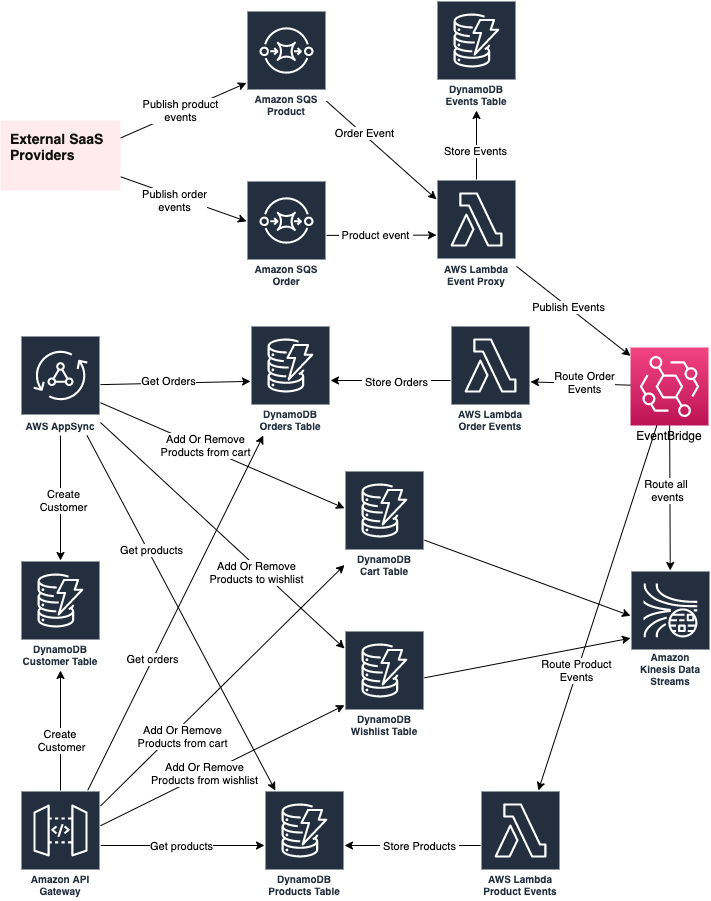

# AWS Services with Terraform and Typescript

## Description
This is a demo repo on seting up different AWS services with Terraform and writing lambdas in Typescript. The AWS services incuded are AWS SQS, AWS EventBridge, AWS CloudWatch, AWS API Gateway, AWS DynamoDB and AWS Lambda. 

It is assumed that Terraform and Nodejs is already installed on your computer and that you can deploy to an AWS Account using Terraform.

## Architecture


## Install
```
$ npm i
```

## Testing
```
$ npm run test
```

## Deploying
```
$ npm run deploy
```
